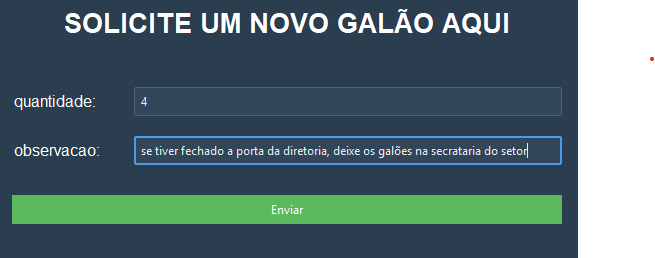
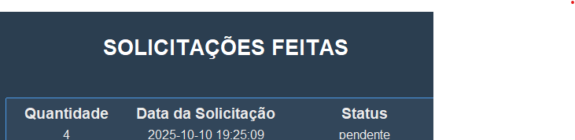
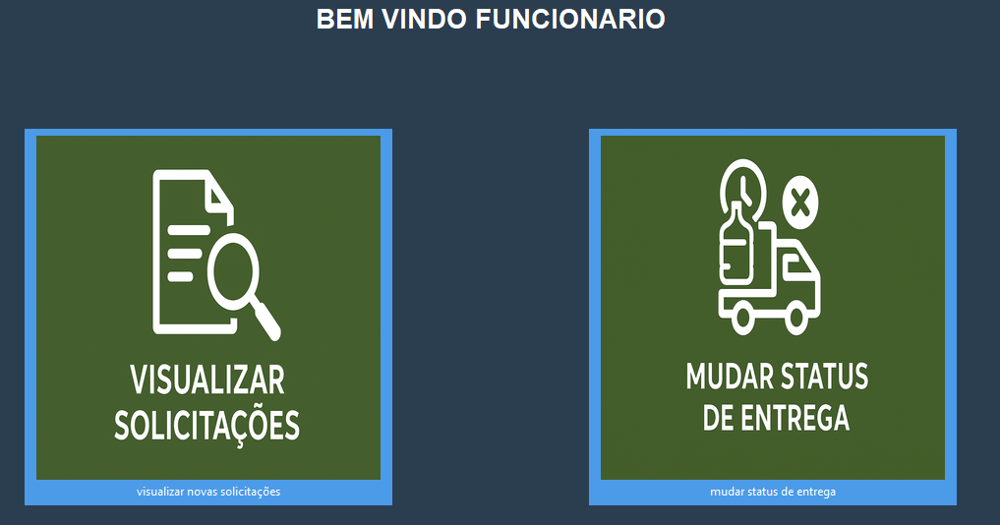
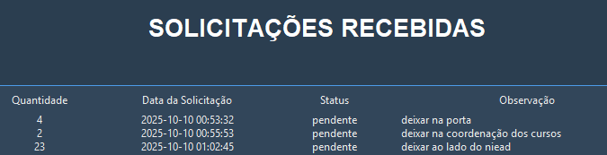
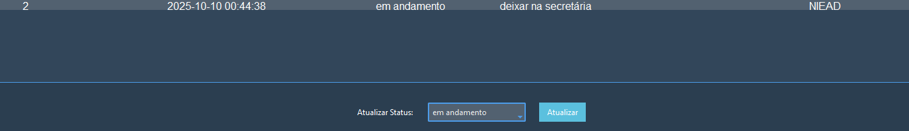
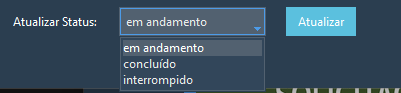

# SISTEMA DE GERENCIAMENTO DE GALÕES DE ÁGUA - SGG
Este projeto tem como objetivo um sistema que facilite o gerenciamento do serviços de galões de água.

## FUNCIONALIDADES PARA UM SOLICITANTE
após fazer login como solicitante, aparecerá a página home onde o usuário solicitante pode fazer uma troca de galão e acompanhar como está o status de entrega das solicitações que ele pediu.

### 1. Solicitação de uma troca de galão
ao clicar no botão para solicitar uma troca de galão, aparecerá um formulário onde o solicitante poederá informar a quantidade de galões que precisa e observações adcionais sobre como ele deseja que seja feita a entrega.

### 2. Acompanhar status de entrega
depois de feita essa solicitação, o solicitante poderá visualiza como está o status de entrega. mostrando a quantiade de galões que ele pediu, a data da solicitação e o status.

## FUNCIONALIDADES PARA UM FUNCIONÁRIO DO SETOR DE ENTREGA DE GALÕES
Ao fazer login como um funcionário, apareçerá duas opções visualizar as novas solicitações que foram feitas e mudar o status de entrega.

### 3. Visualizar solicitações recebidas
ao clicar em visualizar solicitações recebidas, será mostrado as novas solicitações que foram feitas pelo usuários.

### 4. mudar o status de entrega
o funcionário também pode mudar o status de entrega, que indica como está indo a entrega do galão no setor.
para mudar o status ele clica em uma solicitação que aparece na treeview.

e depois seleciona o tipo de status

em andamento: quando foi recebida a solicitação e está em processo de andamento para entrega no setor.

concluido: quando a entrega foi realizada com sucesso.

interrompido: caso tenha acontecido algum problema durante a entrega.

