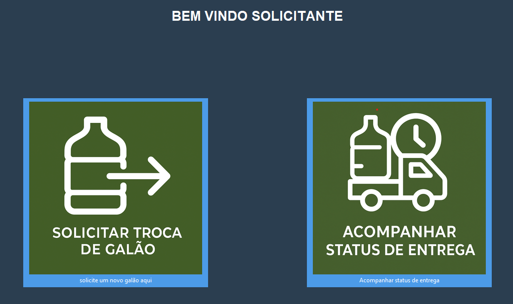

# SISTEMA DE GERENCIAMENTO DE GALÕES DE ÁGUA - SGG
Este projeto tem como objetivo um sistema que facilite o gerenciamento do serviços de galões de água.

## FUNCIONALIDADES PARA UM SOLICITANTE
após fazer login como solicitante, aparecerá a página home onde o usuário solicitante pode fazer uma troca de galão e acompanhar como está o status de entrega das solicitações que ele pediu.

### 1. Solicitação de uma troca de galão
### 2. Acompanhar status de entrega
## FUNCIONALIDADES PARA UM FUNCIONÁRIO DO SETOR DE ENTREGA DE GALÕES
### 3. Visualizar solicitações recebidas
### 4. mudar o status de entrega
